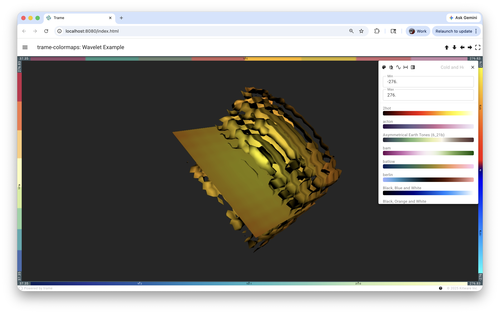
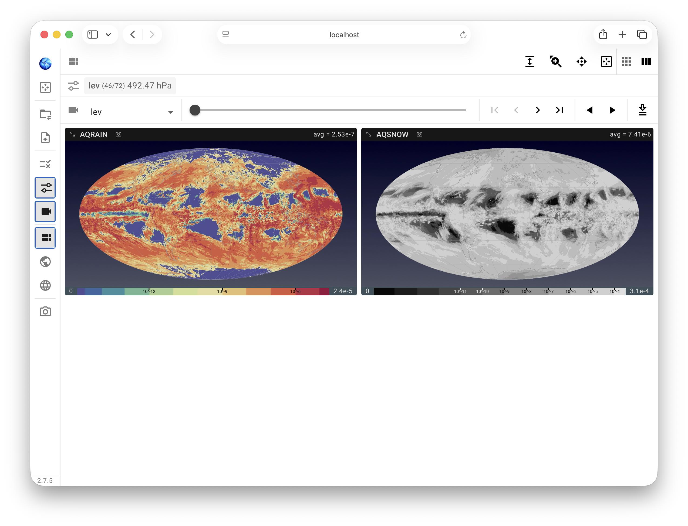

# trame-colormaps

Self-contained colormap module for managing VTK color transfer
functions, colorbar rendering, and interactive preset controls in Trame apps.

## Screenshots

### Horizontal and vertical colorbars with preset picker



The wavelet example (`examples/wavelet.py`) shows four colorbars around a 3D view:
two horizontal bars (top and bottom) and two vertical bars (left and right).
Clicking any colorbar opens its control panel with preset picker, scale mode,
and discrete settings. Only one panel can be open at a time.

### Real-world integration — horizontal footer colorbar



A production app using `trame-colormaps` for climate data visualization.
Each data variable gets its own horizontal colorbar at the bottom of the view,
with symlog tick marks that adapt to the data range. This is the simplest
integration pattern — a single `Colorbar` with `orientation="horizontal"`
placed in a footer.

## Public API

All public symbols are exported from `trame_colormaps/__init__.py`:

| Symbol | Source | Purpose |
|--------|--------|--------|
| `Colorbar` | `colorbar.py` | **Recommended.** Self-contained colorbar: owns config, controller, and UI. |
| `create_colorbar` | `colorbar.py` | Colorbar for composed configs (when colormap fields live in a larger StateDataModel) |
| `ColormapController` | `controller.py` | Per-view CTF manager: creates CTF, wires mapper, manages presets/range/ticks |
| `ColormapConfig` | `state.py` | Reactive state model with all colormap fields (standalone use) |
| `ControlPanel` | `control_panel.py` | Class-based control panel (used internally by `Colorbar`) |
| `create_control_panel` | `control_panel.py` | Standalone control panel (preset picker, scale, range, discrete) |

## Preset Data Sources

All colormap presets are stored as JSON files under `src/trame_colormaps/presets/`.

### `paraview_colormaps.json` — Built-in Presets

- **Source:** [ParaView ColorMaps.json](https://gitlab.kitware.com/paraview/paraview/-/raw/master/Remoting/Views/ColorMaps.json)
- **License:** BSD-3-Clause
- **199 colormaps** including Brewer, matplotlib, and other community-contributed presets
- Presets that originally used `IndexedColors` (discrete/qualitative) have been
  converted to `RGBPoints` with evenly spaced control points for uniform handling

### `crameri_colormaps.json` — Crameri Scientific Colour Maps

- **Source:** [Fabio Crameri's Scientific Colour Maps](https://www.fabiocrameri.ch/colourmaps/)
- **License:** MIT
- **60 colormaps** — sequential, diverging, multi-sequential, cyclic, and categorical
- All are perceptually uniform and color-blind safe
- Downloaded from the [cmcrameri GitHub repository](https://github.com/callumrollo/cmcrameri)

### `default_presets.json` — Active Preset List

A JSON array of colormap names that controls which presets are active by default.
Includes all non-Brewer presets, only the highest-count Brewer variants, and the
core 15 Crameri colormaps. Each preset entry includes a `"ColorBlindSafe"`
boolean field for filtering.

### Configuring Active Presets

On import, the active preset list is loaded from `default_presets.json`. Use
`set_active_presets()` to override it at runtime:

```python
from trame_colormaps.core.presets import get_active_presets, set_active_presets

# Get the current active list
presets = get_active_presets()

# Set from a Python list
set_active_presets(["Cool to Warm", "batlow", "vik", "Viridis (matplotlib)"])

# Set from a JSON file
set_active_presets("/path/to/my_presets.json")
```

## Configurable Parameters

All parameters have sensible defaults and are backward-compatible keyword arguments.

### `state.py` — `ColormapConfig` (reactive, user-facing)

| Field | Default | Description |
|-------|---------|-------------|
| `active_presets` | `default_presets.json` | List of preset names available in the picker |
| `n_intervals` | `4` | Number of equal intervals for discrete linear mode |
| `n_ticks` | `5` | Desired number of tick marks on the colorbar |
| `n_discrete_colors` | `4` | Number of sub-bands per interval (1–20) |
| `n_colors` | `255` | Number of LUT samples |

These are synced to the Trame client and trigger reactive updates via the controller.

### `core/presets.py` — function parameters

| Parameter | Default | Function | Description |
|-----------|---------|----------|-------------|
| `samples` | `255` | `generate_colormaps()` | Horizontal pixels in each colorbar image |
| `preset_list` | `default_presets.json` | `set_active_presets()` | List of names or path to JSON file |

### `core/ticks.py` — function parameters

| Parameter | Default | Function | Description |
|-----------|---------|----------|-------------|
| `n` | `5` | `compute_color_ticks()` | Desired number of tick marks |
| `min_gap` | `7` | `compute_color_ticks()` | Minimum gap between ticks (percentage points) |
| `edge_margin` | `3` | `compute_color_ticks()` | Minimum distance from edges (percentage points) |
| `linthresh` | `1.0` (symlog), `1e-15` (log) | `get_nice_ticks()`, `compute_color_ticks()` | Linear threshold for log/symlog scales |

### Tick mark behavior

Tick marks are computed identically for discrete and continuous modes:

- **Linear**: evenly spaced interval boundaries (e.g. 25%, 50%, 75% for `n_intervals=4`)
- **Log**: only powers of 10 (decade marks) that fall within the data range
- **Symlog**: powers of 10 filtered by visual position spacing — ticks far from zero (where the symlog transform expands the scale) are shown at every decade, while ticks near zero (where the transform compresses values) are adaptively thinned to prevent overlap. Zero is always shown when it falls within the data range and away from edges.

The adaptive spacing uses the symlog-transformed position of each candidate tick: only ticks that are at least `100/n` percentage points apart in visual space are kept. This naturally produces a nonlinear stride — larger gaps near zero, smaller gaps at extremes.

### `core/transforms.py` — function parameters

| Parameter | Default | Function | Description |
|-----------|---------|----------|-------------|
| `n_intervals` | `4` | `apply_discrete_linear()` | Number of equal intervals to divide the data range |
| `n_sub` | `1` | All `apply_discrete_*()` functions | Number of sub-bands per interval/decade |
| `n_samples` | `256` | `apply_discrete_log()`, `apply_symlog()`, `apply_discrete_symlog()` | Resampling resolution for building continuous CTFs |

## Dependencies

| Package | Used in | Purpose |
|---------|---------|--------|
| **vtk** (`vtkmodules`) | `core/presets.py`, `core/transforms.py`, `controller.py` | `vtkColorTransferFunction` for color sampling, `vtkPNGWriter`/`vtkImageData` for colorbar image generation |
| **numpy** | `core/ticks.py`, `core/transforms.py` | Tick computation, LUT transforms |
| **trame** | `state.py`, `colorbar.py`, `control_panel.py` | `StateDataModel` for reactive config, Vuetify 3 widgets for UI |
| **trame-dataclass** | `state.py` | `StateDataModel` base class; `provide_as` scoped slot |

## Module Structure

```
src/trame_colormaps/
├── __init__.py          # Re-exports: Colorbar, ColormapController, ColormapConfig
├── colorbar.py          # Colorbar — self-contained colorbar (config + controller + UI)
├── control_panel.py     # Preset picker, scale mode, range, discrete settings
├── state.py             # ColormapConfig(StateDataModel) — reactive color state
├── controller.py        # ColormapController — owns LUT, wires mapper, manages presets/range/ticks
├── core/
│   ├── presets.py       # Preset discovery, COLORBAR_CACHE, lut_to_img()
│   ├── ticks.py         # Tick computation (linear, log, symlog)
│   └── transforms.py   # LUT transforms (linear, log, symlog, discrete variants)
└── presets/
    ├── paraview_colormaps.json   # 199 ParaView built-in presets
    ├── crameri_colormaps.json    # 60 Crameri scientific colour maps
    └── default_presets.json      # Active preset list with color-blind-safe flags
```

## Layer Separation

| Layer | Modules | Dependencies |
|-------|---------|-------------|
| **Core** (pure VTK/numpy) | `core/presets.py`, `core/ticks.py`, `core/transforms.py` | VTK, numpy |
| **State** (Trame reactive model) | `state.py` | trame |
| **Controller** (orchestration) | `controller.py` | Core + State + VTK |
| **Widgets** (UI) | `colorbar.py`, `control_panel.py` | trame (Vuetify 3) |

The core layer has zero Trame dependency and can be used independently
for headless colormap operations.

## Widget Structure

`Colorbar.render()` produces the following DOM tree:

```
html.Div  (top-level — flexbox row/column, bg-blue-grey-darken-2)
├── VMenu  (activator="parent" — click anywhere on the bar to open)
│   └── ControlPanel → VCard (360px popup)
│       ├── VCardItem: toggle buttons (color-blind, invert, scale, range, discrete)
│       ├── VCardItem: discrete color count input (v-show when discrete)
│       ├── VCardItem: min/max text fields (v-show when override_range)
│       ├── VDivider
│       └── VList: searchable preset list with thumbnail images
├── html.Div  (min range label)
├── html.Div  (colorbar image container, position:relative)
│   ├── html.Img  (LUT image — horizontal or vertical depending on orientation)
│   └── html.Div  (tick overlay, position:absolute, pointer-events:none)
│       └── html.Div v-for="tick in config.color_ticks"
│           ├── html.Div  (tick line)
│           └── html.Span (tick label)
└── html.Div  (max range label)
```

Template bindings use `config.*` via `config.provide_as("config")`.
When one control panel opens, all others close automatically.
The popup panel position is controlled by `popup_location`:
`"top"` → above bar, `"bottom"` → below, `"start"` → left, `"end"` → right.

The control panel reads `config.luts_normal` / `config.luts_inverted`,
populated reactively by the controller when `active_presets` changes.

## Config Fields

The `config` object passed to `ColormapController` and `Colorbar`
must be a `trame.app.dataclass.StateDataModel` (or subclass) with the
following fields. All fields are required. `ColormapConfig` in `state.py`
provides the canonical definition with defaults.

| Field | Type | Default | Role |
|-------|------|---------|------|
| **User-settable (read by controller, bound to UI)** ||||
| `active_presets` | `list[str]` | `default_presets.json` | Preset names available in the picker |
| `preset` | `str` | `"BuGnYl"` | Active color preset name |
| `invert` | `bool` | `False` | Invert the transfer function |
| `color_blind` | `bool` | `False` | Filter preset list to color-blind safe |
| `use_log_scale` | `str` | `"linear"` | Scale mode: `"linear"`, `"log"`, `"symlog"` |
| `discrete_log` | `bool` | `False` | Enable discrete banding |
| `n_discrete_colors` | `int` | `4` | Number of discrete sub-bands (1–20) |
| `n_intervals` | `int` | `4` | Equal intervals for discrete linear mode |
| `n_ticks` | `int` | `5` | Desired tick marks on the colorbar |
| `color_value_min` | `str` | `"0"` | Manual range min (string for text field) |
| `color_value_max` | `str` | `"1"` | Manual range max (string for text field) |
| `override_range` | `bool` | `False` | Use manual range instead of data range |
| **Derived (written by controller, read by UI)** ||||
| `color_range` | `tuple[float, float]` | `(0, 1)` | Active min/max color range |
| `color_value_min_valid` | `bool` | `True` | Whether `color_value_min` parses as a valid float |
| `color_value_max_valid` | `bool` | `True` | Whether `color_value_max` parses as a valid float |
| `n_colors` | `int` | `255` | Number of LUT samples |
| `lut_img_h` | `str` | `""` | Base64 PNG data URI of the horizontal colorbar image |
| `lut_img_v` | `str` | `""` | Base64 PNG data URI of the vertical colorbar image |
| `color_ticks` | `list` | `[]` | Tick marks: `[{position, label, color}, ...]` |
| `effective_color_range` | `tuple[float, float]` | `(0, 1)` | Actual CTF range after transforms |
| `luts_normal` | `list` | `[]` | Sorted preset picker entries (normal) |
| `luts_inverted` | `list` | `[]` | Sorted preset picker entries (inverted) |
| **UI widget state (used by control panel / colorbar)** ||||
| `menu` | `bool` | `False` | Whether the control panel popup is open |
| `search` | `str \| None` | `None` | Preset search filter text |
| `orientation` | `str` | `"horizontal"` | Colorbar orientation: `"horizontal"` or `"vertical"` |

When composing into a larger application config, include all fields above
alongside your app-specific fields. The controller reads and writes them
by name — no inheritance required.

## Usage

### Recommended: `Colorbar` (self-contained)

The `Colorbar` class bundles config, controller, and UI into a single object.

```python
from trame_colormaps import Colorbar


def get_data_array():
    """Return the VTK data array the colorbar should map.

    Called by the controller whenever it needs to recompute the color
    range (e.g. on preset change, data update, or manual range reset).
    """
    ds = my_source.GetOutput()
    if ds is None:
        return None
    return ds.GetPointData().GetScalars()


def do_render():
    """Trigger a view update after the controller changes the LUT.

    Called automatically after every color change (preset swap, range
    edit, scale toggle, etc.) so the 3D view stays in sync.
    """
    ctrl.view_update()


# Create a colorbar (each instance gets its own config and controller)
colorbar = Colorbar(
    server=server,
    variable_name="RTData",
    mapper=my_mapper,
    data_array_fn=get_data_array,
    render_fn=do_render,
    orientation="horizontal",   # or "vertical"
    scalar_mode="default",      # "default", "point", or "cell"
    popup_location="top",       # "top", "bottom", "start", "end"
)

# Inside your layout, call render() to emit the DOM:
colorbar.render()
```

**Multiple colorbars** are fully supported. When one control panel is opened,
all others close automatically:

```python
cb_top = Colorbar(server=server, variable_name="RTData", mapper=mapper,
                  data_array_fn=get_data, render_fn=render,
                  orientation="horizontal", popup_location="bottom")

cb_left = Colorbar(server=server, variable_name="RTData", mapper=mapper,
                   data_array_fn=get_data, render_fn=render,
                   orientation="vertical", popup_location="end")

# In layout:
with layout:
    cb_top.render()   # horizontal bar at top
    cb_left.render()  # vertical bar on left
```

#### `Colorbar` constructor parameters

| Parameter | Default | Description |
|-----------|---------|-------------|
| `server` | *required* | Trame server instance |
| `variable_name` | *required* | Scalar array name to color by |
| `mapper` | *required* | VTK mapper to wire the color transfer function to |
| `data_array_fn` | *required* | Callable returning the VTK data array |
| `render_fn` | *required* | Callable to trigger a view update after changes |
| `orientation` | `"horizontal"` | `"horizontal"` or `"vertical"` |
| `scalar_mode` | `"default"` | `"default"`, `"point"`, or `"cell"` |
| `config` | `None` | Optional `ColormapConfig` to reuse; a new one is created if `None` |
| `popup_location` | auto | Where the control panel pops up: `"top"`, `"bottom"`, `"start"`, `"end"`. Defaults to `"top"` for horizontal, `"end"` for vertical |

#### `Colorbar` attributes

| Attribute | Description |
|-----------|-------------|
| `config` | The `ColormapConfig` instance |
| `controller` | The `ColormapController` instance |
| `panel` | The `ControlPanel` instance |

### Composed config: `ColormapController` + `create_colorbar`

Use `create_colorbar` when colormap fields are composed into a larger
application config rather than using a standalone `ColormapConfig`.
The caller creates the controller and wires the mapper:

```python
from trame.app import dataclass
from trame_colormaps import ColormapController, ColormapConfig, create_colorbar

class ViewConfiguration(dataclass.StateDataModel):
    # Application-specific fields
    variable: str = dataclass.Sync(str)
    order: int = dataclass.Sync(int, 0)
    size: int = dataclass.Sync(int, 6)

    # Colormap fields (same as ColormapConfig)
    preset: str = dataclass.Sync(str, "Cool to Warm")
    invert: bool = dataclass.Sync(bool, False)
    # ... all other ColormapConfig fields ...

config = ViewConfiguration(server, variable="Temperature")
controller = ColormapController(
    server=server,
    variable_name="Temperature",
    mapper=my_mapper,
    data_array_fn=lambda: get_data_array(),
    render_fn=render,
    config=config,
    scalar_mode="cell",
)

# In UI building:
create_colorbar(config, controller.update_color_preset)
```

### Controller Methods

| Method | Purpose |
|--------|--------|
| `update_color_range()` | Recompute range from data (or validate manual range), re-apply transforms, regenerate ticks |
| `update_color_preset(name, invert, log_scale, ...)` | Apply a preset with scale/discrete settings — also called automatically by reactive watchers |
| `set_data_array(variable_name, data_array_fn, scalar_mode)` | Switch to a different data array at runtime — reconfigures mapper, recomputes range, re-applies preset |

### Updating color range after data changes

When the underlying data changes (e.g. new data loaded, pipeline update),
call `update_color_range()` on the controller to recompute the range,
re-apply transforms, and regenerate ticks:

```python
colorbar.controller.update_color_range()
```

### Switching data array at runtime

To color by a different variable without creating a new controller:

```python
colorbar.controller.set_data_array(
    "Pressure",
    data_array_fn=lambda: get_pressure_array(),
    scalar_mode="point",  # "cell" (default), "point", or "default"
)
```

## Examples

| File | Description |
|------|-------------|
| `examples/wavelet.py` | 4-region layout with horizontal + vertical colorbars |
