# Colormaps Reference

Complete catalog of available colormaps with colorbar previews and metadata.

**Total: 259 colormaps** (199 ParaView built-in + 60 Crameri scientific)

## ParaView Built-in Colormaps

199 colormaps from the [ParaView](https://github.com/Kitware/ParaView/blob/master/Remoting/Views/ColorMaps.json) project.

**Blue - Green - Orange** — CIELAB

**Cool to Warm** — Diverging

**Warm to Cool** — Diverging

**ParaView 6.0.0 Default** — Diverging — ParaView 6.0.0

**blot** — HSV

**Blue to Red Rainbow** — HSV

**2hot** — Lab

**BLUE-WHITE** — Lab

**blue2cyan** — Lab

**blue2yellow** — Lab

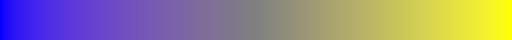

**Blues** — Lab

**bone_Matlab** — Lab

**BrBG** — Lab

**BrOrYl** — Lab

**BuGn** — Lab

**BuGnYl** — Lab

**BuPu** — Lab

**BuRd** — Lab

**CIELab Blue to Red** — Lab

**copper_Matlab** — Lab

**erdc_blue2cyan_BW** — Lab

**erdc_blue2gold** — Lab

**erdc_blue2gold_BW** — Lab

**erdc_blue2green_BW** — Lab

**erdc_blue2green_muted** — Lab

**erdc_blue2yellow** — Lab

**erdc_blue_BW** — Lab

**erdc_brown_BW** — Lab

**erdc_cyan2orange** — Lab

**erdc_divHi_purpleGreen** — Lab

**erdc_divHi_purpleGreen_dim** — Lab

**erdc_divLow_icePeach** — Lab

**erdc_divLow_purpleGreen** — Lab

**erdc_gold_BW** — Lab

**erdc_green2yellow_BW** — Lab

**erdc_iceFire_H** — Lab

**erdc_iceFire_L** — Lab

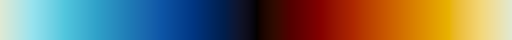

**erdc_magenta_BW** — Lab

**erdc_marine2gold_BW** — Lab

**erdc_orange_BW** — Lab

**erdc_pbj_lin** — Lab

**erdc_purple2green** — Lab

**erdc_purple2green_dark** — Lab

**erdc_purple2pink_BW** — Lab

**erdc_purple_BW** — Lab

**erdc_rainbow_bright** — Lab

**erdc_rainbow_dark** — Lab

**erdc_red2purple_BW** — Lab

**erdc_red2yellow_BW** — Lab

**erdc_red_BW** — Lab

**erdc_sapphire2gold_BW** — Lab

**GBBr** — Lab

**gist_earth** — Lab

**GnBu** — Lab

**GnBuPu** — Lab

**GnRP** — Lab

**GnYlRd** — Lab

**Gray and Red** — Lab

**GREEN-WHITE_LINEAR** — Lab

**Greens** — Lab

**GYPi** — Lab

**GyRd** — Lab

**Haze_cyan** — Lab

**Haze_green** — Lab

**Haze_lime** — Lab

**heated_object** — Lab

**hue_L60** — Lab

**magenta** — Lab

**nic_CubicL** — Lab

**nic_CubicYF** — Lab

**nic_Edge** — Lab

**Oranges** — Lab

**OrPu** — Lab

**pink_Matlab** — Lab

**PiYG** — Lab

**PRGn** — Lab

**PuBu** — Lab

**PuOr** — Lab

**PuRd** — Lab

**Purples** — Lab

**RdOr** — Lab

**RdOrYl** — Lab

**RdPu** — Lab

**RED-PURPLE** — Lab

**RED_TEMPERATURE** — Lab

**Reds** — Lab

**Spectral_lowBlue** — Lab

**Viridis** — Lab — Eric Firing

**Asymmetrical Earth Tones (6_21b)** — Lab — Francesca Samsel

**Blue Orange (divergent)** — Lab — Francesca Samsel

**Cool to Warm (Extended)** — Lab — Francesca Samsel

**Green-Blue Asymmetric Divergent (62Blbc)** — Lab — Francesca Samsel

**Linear Blue (8_31f)** — Lab — Francesca Samsel

**Linear Green (Gr4L)** — Lab — Francesca Samsel

**Linear YGB 1211g** — Lab — Francesca Samsel

**Muted Blue-Green** — Lab — Francesca Samsel

**Warm to Cool (Extended)** — Lab — Francesca Samsel

**Yellow - Gray - Blue** — Lab — Francesca Samsel

**Yellow 15** — Lab — Francesca Samsel

**Fast** — Lab — Francesca Samsel, and Alan W. Scott

**Fast (Blues)** — Lab — Francesca Samsel, and Alan W. Scott

**Fast (Reds)** — Lab — Francesca Samsel, and Alan W. Scott

**Cividis** — Lab — Jamie R. Nuñez, Christopher R. Anderton, and Ryan S. Renslow

**Inferno** — Lab — Nathaniel J. Smith & Stefan van der Walt

**Magma** — Lab — Nathaniel J. Smith & Stefan van der Walt

**Plasma** — Lab — Nathaniel J. Smith & Stefan van der Walt

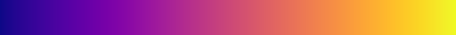

**Black, Blue and White** — RGB

**Black, Orange and White** — RGB

**Black-Body Radiation** — RGB

**Blue to Yellow** — RGB

**BlueObeliskElements** — RGB

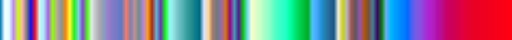

**Blues** — RGB

**Brewer Diverging Brown-Blue-Green (10)** — RGB

**Brewer Diverging Brown-Blue-Green (11)** — RGB

**Brewer Diverging Brown-Blue-Green (3)** — RGB

**Brewer Diverging Brown-Blue-Green (4)** — RGB

**Brewer Diverging Brown-Blue-Green (5)** — RGB

**Brewer Diverging Brown-Blue-Green (6)** — RGB

**Brewer Diverging Brown-Blue-Green (7)** — RGB

**Brewer Diverging Brown-Blue-Green (8)** — RGB

**Brewer Diverging Brown-Blue-Green (9)** — RGB

**Brewer Diverging Purple-Orange (10)** — RGB

**Brewer Diverging Purple-Orange (11)** — RGB

**Brewer Diverging Purple-Orange (3)** — RGB

**Brewer Diverging Purple-Orange (4)** — RGB

**Brewer Diverging Purple-Orange (5)** — RGB

**Brewer Diverging Purple-Orange (6)** — RGB

**Brewer Diverging Purple-Orange (7)** — RGB

**Brewer Diverging Purple-Orange (8)** — RGB

**Brewer Diverging Purple-Orange (9)** — RGB

**Brewer Diverging Spectral (10)** — RGB

**Brewer Diverging Spectral (11)** — RGB

**Brewer Diverging Spectral (3)** — RGB

**Brewer Diverging Spectral (4)** — RGB

**Brewer Diverging Spectral (5)** — RGB

**Brewer Diverging Spectral (6)** — RGB

**Brewer Diverging Spectral (7)** — RGB

**Brewer Diverging Spectral (8)** — RGB

**Brewer Diverging Spectral (9)** — RGB

**Brewer Qualitative Accent** — RGB

**Brewer Qualitative Dark2** — RGB

**Brewer Qualitative Paired** — RGB

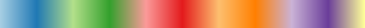

**Brewer Qualitative Pastel1** — RGB

**Brewer Qualitative Pastel2** — RGB

**Brewer Qualitative Set1** — RGB

**Brewer Qualitative Set2** — RGB

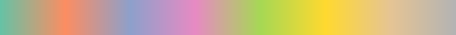

**Brewer Qualitative Set3** — RGB

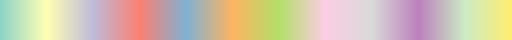

**Brewer Sequential Blue-Green (3)** — RGB

**Brewer Sequential Blue-Green (4)** — RGB

**Brewer Sequential Blue-Green (5)** — RGB

**Brewer Sequential Blue-Green (6)** — RGB

**Brewer Sequential Blue-Green (7)** — RGB

**Brewer Sequential Blue-Green (8)** — RGB

**Brewer Sequential Blue-Green (9)** — RGB

**Brewer Sequential Blue-Purple (3)** — RGB

**Brewer Sequential Blue-Purple (4)** — RGB

**Brewer Sequential Blue-Purple (5)** — RGB

**Brewer Sequential Blue-Purple (6)** — RGB

**Brewer Sequential Blue-Purple (7)** — RGB

**Brewer Sequential Blue-Purple (8)** — RGB

**Brewer Sequential Blue-Purple (9)** — RGB

**Brewer Sequential Yellow-Orange-Brown (3)** — RGB

**Brewer Sequential Yellow-Orange-Brown (4)** — RGB

**Brewer Sequential Yellow-Orange-Brown (5)** — RGB

**Brewer Sequential Yellow-Orange-Brown (6)** — RGB

**Brewer Sequential Yellow-Orange-Brown (7)** — RGB

**Brewer Sequential Yellow-Orange-Brown (8)** — RGB

**Brewer Sequential Yellow-Orange-Brown (9)** — RGB

**Citrus** — RGB

**Cold and Hot** — RGB

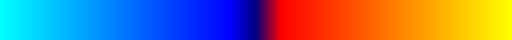

**Cool** — RGB

**Grayscale** — RGB

**Haze** — RGB

**hsv** — RGB

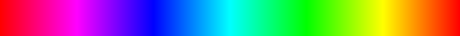

**Jet** — RGB

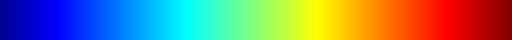

**KAAMS** — RGB

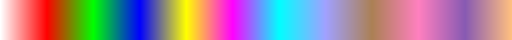

**Rainbow Blended Black** — RGB

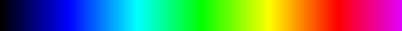

**Rainbow Blended Grey** — RGB

**Rainbow Blended White** — RGB

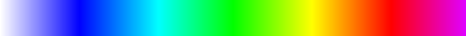

**Rainbow Desaturated** — RGB

**Spectrum** — RGB

**Traffic Lights** — RGB

**Traffic Lights For Deuteranopes** — RGB

**Traffic Lights For Deuteranopes 2** — RGB

**Warm** — RGB

**Wild Flower** — RGB

**X Ray** — RGB

**Turbo** — RGB — Anton Mikhailov

**Rainbow Uniform** — RGB — Colin Ware

**Blues Step** — Step

**Citrus Step** — Step

**Cool Step** — Step

**KAAMS Step** — Step

**Spectrum Step** — Step

**Traffic Lights For Deuteranopes 2 Step** — Step

**Traffic Lights For Deuteranopes Step** — Step

**Traffic Lights Step** — Step

**Warm Step** — Step

**Wild Flower Step** — Step

## Crameri Scientific Colour Maps

60 colormaps from [Fabio Crameri](https://www.fabiocrameri.ch/colourmaps/) — perceptually uniform and color-blind safe.

**actonS** — RGB — categorical

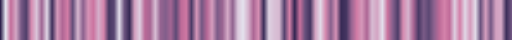

**bamakoS** — RGB — categorical

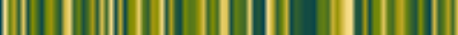

**batlowKS** — RGB — categorical

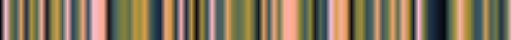

**batlowS** — RGB — categorical

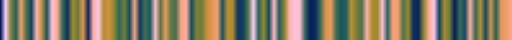

**batlowWS** — RGB — categorical

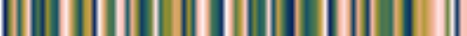

**bilbaoS** — RGB — categorical

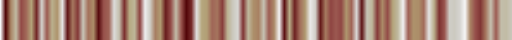

**budaS** — RGB — categorical

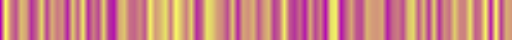

**davosS** — RGB — categorical

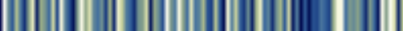

**devonS** — RGB — categorical

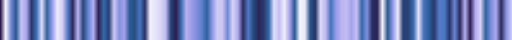

**glasgowS** — RGB — categorical

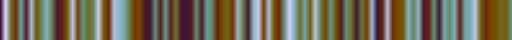

**grayCS** — RGB — categorical

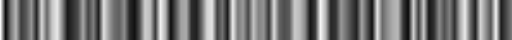

**hawaiiS** — RGB — categorical

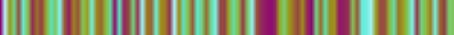

**imolaS** — RGB — categorical

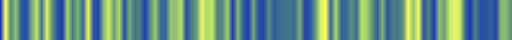

**lajollaS** — RGB — categorical

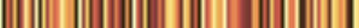

**lapazS** — RGB — categorical

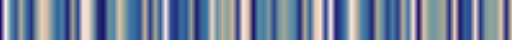

**lipariS** — RGB — categorical

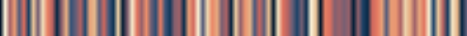

**naviaS** — RGB — categorical

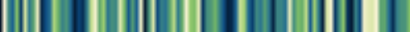

**nuukS** — RGB — categorical

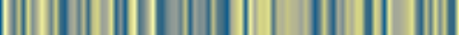

**osloS** — RGB — categorical

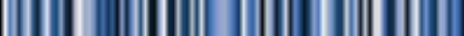

**tokyoS** — RGB — categorical

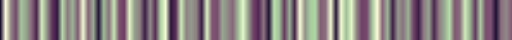

**turkuS** — RGB — categorical

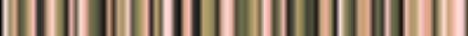

**bamO** — RGB — cyclic

**brocO** — RGB — cyclic

**corkO** — RGB — cyclic

**romaO** — RGB — cyclic

**vikO** — RGB — cyclic

**bam** — RGB — diverging

**berlin** — RGB — diverging

**broc** — RGB — diverging

**cork** — RGB — diverging

**lisbon** — RGB — diverging

**managua** — RGB — diverging

**roma** — RGB — diverging

**tofino** — RGB — diverging

**vanimo** — RGB — diverging

**vik** — RGB — diverging

**bukavu** — RGB — multi-sequential

**fes** — RGB — multi-sequential

**oleron** — RGB — multi-sequential

**acton** — RGB — sequential

**bamako** — RGB — sequential

**batlow** — RGB — sequential

**batlowK** — RGB — sequential

**batlowW** — RGB — sequential

**bilbao** — RGB — sequential

**buda** — RGB — sequential

**davos** — RGB — sequential

**devon** — RGB — sequential

**glasgow** — RGB — sequential

**grayC** — RGB — sequential

**hawaii** — RGB — sequential

**imola** — RGB — sequential

**lajolla** — RGB — sequential

**lapaz** — RGB — sequential

**lipari** — RGB — sequential

**navia** — RGB — sequential

**nuuk** — RGB — sequential

**oslo** — RGB — sequential

**tokyo** — RGB — sequential

**turku** — RGB — sequential

---

*Generated from `paraview_colormaps.json` and `crameri_colormaps.json`.*